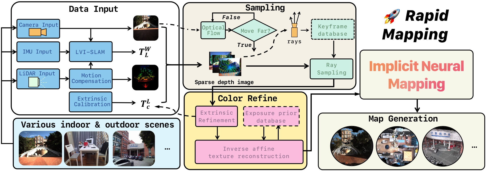
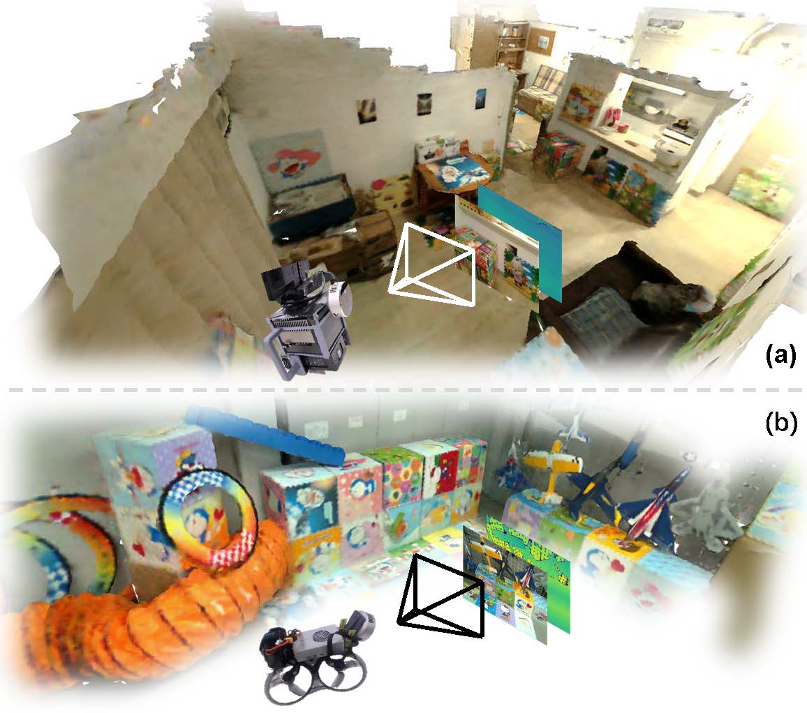

<html>
  <table style="width:100%;border:0px;border-spacing:0px;border-collapse:separate;margin-right:auto;margin-left:auto;">
          <tr onmouseout="nightsight_stop()" onmouseover="nightsight_start()">
            <td style="padding:20px;width:25%;vertical-align:middle;border-left-style:none;border-bottom-style:none;border-top-style:none;border-right-style:none">
              
            </td>
            <td style="padding:20px;width:75%;vertical-align:middle;border-left-style:none;border-bottom-style:none;border-top-style:none;border-right-style:none">
                <papertitle>Rapid-Mapping: LiDAR-Visual Implicit Neural Representations for Real-Time Dense Mapping
                </papertitle>
                
                Hanwen Zhang, Yujie Zou, Zhewen Yan, Hui Cheng
               
              <em>IEEE Robotics and Automation Letters, 2024. </em> 
            </td>
          </tr>
    </table>

</html>

<html>
    <table style="width:100%;border:0px;border-spacing:0px;border-collapse:separate;margin-right:auto;margin-left:auto;">
          <tr onmouseout="nightsight_stop()" onmouseover="nightsight_start()">
            <td style="padding:20px;width:50%;vertical-align:middle;border-left-style:none;border-bottom-style:none;border-top-style:none;border-right-style:none">
              
            </td>
            <td style="padding:20px;width:75%;vertical-align:middle;border-left-style:none;border-bottom-style:none;border-top-style:none;border-right-style:none">
                <papertitle>H2-Mapping: Real-time Dense Mapping Using Hierarchical Hybrid Representation
                </papertitle>
               
                Chenxing JIANG*, <strong>Hanwen Zhang</strong>*, Peize Liu, Zehuan Yu, Hui Cheng, Boyu Zhou, Shaojie Shen
               
              <em>* Co-first author. Orded Determined by coin flip.</em> 
              <em>IEEE Robotics and Automation Letters, 2023. <strong>(Best Paper Award)</strong> </em> 
              
              
              
                
              
              
            </td>
          </tr>
    </table>
    <!-- <table style="width:100%;border:0px;border-spacing:0px;border-collapse:separate;margin-right:auto;margin-left:auto;">
          <tr onmouseout="nightsight_stop()" onmouseover="nightsight_start()">
            <td style="padding:20px;width:25%;vertical-align:middle;border-left-style:none;border-bottom-style:none;border-top-style:none;border-right-style:none">
              
            </td>
            <td style="padding:20px;width:75%;vertical-align:middle;border-left-style:none;border-bottom-style:none;border-top-style:none;border-right-style:none">
                <papertitle>DIDO:Deep Inertial Quadrotor Dynamical Odometry
                </papertitle>
               
                Kunyi Zhang, <strong>Chenxing Jiang</strong>, Jinghang Li, Sheng Yang, Teng Ma, Chao Xu, Fei Gao
               
              <em>IEEE Robotics and Automation Letters, 2022.</em> 
              
              
              
              
            </td>
          </tr>
    </table> -->
</html>


  
You can also find my articles on <a href="{{site.author.googlescholar}}">my Google Scholar profile</a>.






  


<table style="width:100%;border:0px;border-spacing:0px;border-collapse:separate;margin-right:auto;margin-left:auto;">
          <tr onmouseout="nightsight_stop()" onmouseover="nightsight_start()">
            <td style="padding:20px;width:25%;vertical-align:middle;border-left-style:none;border-bottom-style:none;border-top-style:none;border-right-style:none">
              
            </td>
            <td style="padding:20px;width:75%;vertical-align:middle;border-left-style:none;border-bottom-style:none;border-top-style:none;border-right-style:none">
                <papertitle>H2-Mapping: Real-time Dense Mapping Using Hierarchical Hybrid Representation
                </papertitle>
               
                Chenxing JIANG, <strong>Hanwen Zhang</strong>, Peize Liu, Zehuan Yu, Hui Cheng, Boyu Zhou, Shaojie Shen
               
              <em>aaa</em> 
              <em>IEEE Robotics and Automation Letters, 2023. <strong>(Best Paper Award)</strong> </em> 
              
              
              
                
              
              
            </td>
          </tr>
    </table>
